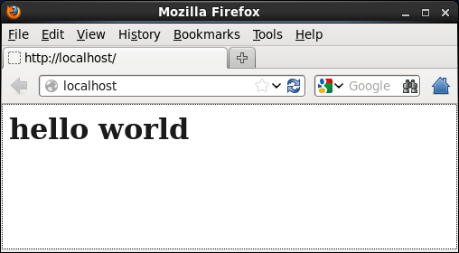
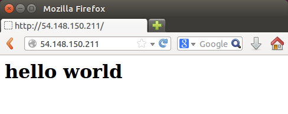
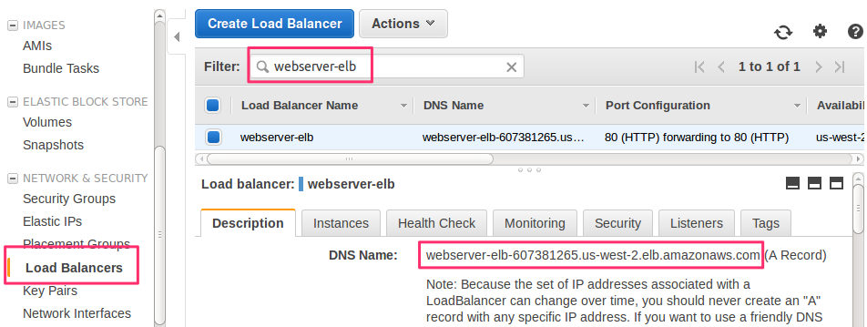
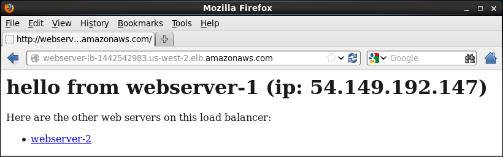
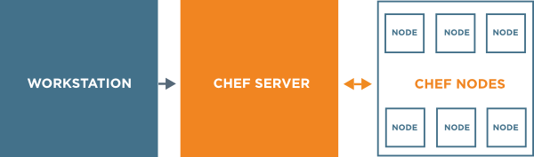

# A first look at Chef: zero to web cluster in 60 minutes

This walkthrough is a quick tour of Chef. Chef is an automation platform that lets you turn your infrastructure into code. With Chef, you'll be able to treat your infrastructure with the same rigor as your applications. When infrastructure is code, it's versionable, testable and repeatable. In this walkthrough, you'll:

* learn how to use code to create policies, such as what packages should be on your web server.
* learn how Chef enforces those policies.
* learn how Chef lets you create and manage multiple servers with a single set of instructions.
* learn how Chef lets you recreate your entire infrastructure, even if there's a disaster.  

You'll start by using a simple policy to configure a web server on a virtual machine. Then you'll deploy that server on a live Amazon EC2 instance using a new Chef feature called _Chef provisioning_. Next, you'll scale by adding additional servers that sit behind a load balancer. Finally, you'll see a simple example of how to use Chef for disaster recovery.

The entire walkthrough takes about an hour to complete.

## What you'll need

You'll need a spare Red Hat Enterprise Linux or CentOS  machine to work from. We tested this tutorial against CentOS 6.5, but it should work on any [supported platform](https://docs.chef.io/supported_platforms.html).

Because you'll run commands that change the state of your system, we recommend that you set up a temporary virtual machine or cloud instance. Ensure you have root or `sudo` access to that system.

One way to set up a local virtual machine is to use Vagrant and Virtual Box.  You can download Vagrant and get setup instructions [here](https://www.vagrantup.com/), download Virtual Box [here](https://www.virtualbox.org/), and download a CentOS 6.5 image (along with other images) [here](https://atlas.hashicorp.com/boxes/search).

Please follow the [Vagrant Setup Instructions](https://docs.vagrantup.com/v2/getting-started/index.html) to get your virtual box up and running.
-- -
**NOTE**

We have you configure a system directly to get started quickly and learn the concepts. In practice, the typical workflow is to install the Chef tools on your development machine and then spin up temporary environments to test your work. More on that in a future tutorial.
-- -

Once you have a machine ready, ensure you have:

* the [Chef Development Kit](http://downloads.chef.io/chef-dk/), or ChefDK, installed on your virtual machine (if your virtual machine doesn't have a graphical user interface, you can run `wget` to get the package listed on the [Red Hat Enterprise Linux download page](http://downloads.chef.io/chef-dk/redhat/#/).)

* the latest versions of the `chef-provisioning` and `chef-provisioning-aws` gems. A version of these gems are included in the ChefDK, but installing the latest will ensure you have the latest updates. Update these gems like this:

  ```bash
$ chef gem update chef-provisioning chef-provisioning-aws
```

* a programmer's text editor. If you like graphical interfaces, we recommend [Atom](https://atom.io/) or [Sublime Text](http://www.sublimetext.com/). If you prefer the command line, there's `vim`, `emacs`, and `nano`.

* (optional) the `tree` utility. We run this command to show you directory structures; install this utility if you'd like to follow along.

  ```bash
$ sudo yum install tree
```

Later in this walkthrough, you'll use Amazon Web Services (AWS) to create EC2 instances. If you don't have an AWS account, sign up for [free tier](http://aws.amazon.com/free/) access.

You'll also need a AWS CLI [configuration file](http://docs.aws.amazon.com/cli/latest/userguide/cli-chap-getting-started.html). At a minimum, you need to have a file named `~/.aws/config` that resembles this one.

```bash
[default]
region=us-west-2
aws_access_key_id = your_access_key_id
aws_secret_access_key = your_secret_access_key
```

## Use Chef to manage policy

A _policy_ declares what state a given piece of infrastructure should be in. You write Chef code to state your desired policy, and Chef ensures that the machine you're configuring meets that policy. When the machine is already in the desired state, Chef takes no action.

Policies apply to resources. A _resource_ defines one piece of the system and its desired state. A file and a directory are two kinds of resources. Software packages such as Apache and MySQL are also examples.

A _recipe_ includes policies that describe one or more related resources.

Here you'll set up an Apache web server that serves up an HTML file.

We'll know that the web server is configured correctly once it meets our desired policy. Let's say that our policy states that:

* the Apache package must be installed.
* the Apache service must be running.
* the Apache service must be enabled when the server boots.
* the web server serves our basic home page.

### 1. Create a Chef repo

With Chef, you treat your infrastructure code just as you would application code. You can version and test infrastructure code, as well as create it in collaboration with others.

A _Chef repo_ is a file and directory structure for your infrastructure code project. If you choose to use a source control system, such as git, you'll map your Chef repo to that system.

Run the following `chef generate` command to create a Chef repo for our web server project.

```bash
$ chef generate repo ~/chef-repo --policy-only
```

Now `cd` to the `~/chef-repo` directory.

```bash
$ cd ~/chef-repo
```

The `chef generate repo` command creates this basic file and directory structure. We chose `~/chef-repo` as the root directory for the repo.

```bash
# ~/chef-repo
$ tree
.
├── certificates
│   └── README.md
├── chefignore
├── config
│   └── rake.rb
├── cookbooks
│   └── README.md
├── data_bags
│   └── README.md
├── environments
│   └── README.md
├── LICENSE
├── Rakefile
├── README.md
└── roles
    └── README.md

6 directories, 10 files
```

Most of these files are initially blank; we'll fill in the necessary details as we go.

### 2. Create a cookbook

A _cookbook_ is a reusable configuration package that typically maps to a piece of software or functionality. For example, the cookbook you'll create here is for a web server.

Let's create a cookbook for our web server. Run the following `chef generate` command to create a cookbook named `web`.

```bash
# ~/chef-repo
$ chef generate cookbook cookbooks/web
```

### 3. Describe the web server policy

The `chef generate` command you just ran created this file structure.

```bash
# ~/chef-repo
$ tree cookbooks/web
cookbooks/web
├── Berksfile
├── chefignore
├── metadata.rb
├── README.md
└── recipes
    └── default.rb

1 directory, 5 files
```

The file `default.rb` is what's called the _default recipe_. You'll add code to the default recipe that describes your web server policy in just a moment. But first, let's review our web server policy. It states that:

* the Apache package must be installed.
* the Apache service must be running.
* the Apache service must be enabled when the server boots.
* the web server serves our basic home page.

We'll use a Chef resource in our default recipe to describe each of these policy items.

Let's start from the top. The first item ensures that the Apache package is installed. To accomplish this, we'll use the `package` resource.

Modify `default.rb` like this.

```ruby
# ~/chef-repo/cookbooks/web/recipes/default.rb
package 'httpd'
```

-- -
**NOTE**

The `package` resource uses the underlying package manager on the system you're configuring to manage a software package. On Red Hat Enterprise Linux and CentOS, for instance, it uses `yum`.

You might notice that resources like `package` help us abstract platform-specific details. Assuming the httpd package exists on another Linux distribution, you can see how you can configure multiple Linux distributions from one cookbook.
-- -

The next two parts of our policy deal with the Apache service. Add the following `service` resource to `default.rb`, making the entire file look like this.

```ruby
# ~/chef-repo/cookbooks/web/recipes/default.rb
package 'httpd'

service 'httpd' do
  action [:enable, :start]
end
```

Notice the `action` part of the `service` resource. Think of an action as the process that achieves the desired policy.

Every resource in Chef has a default action, for example, _install_ a package. In fact, `:install` is the default action for `package`; that's why we didn't specify it. Of course you can specify the action if you want to. The documentation for each resource type, [package](https://docs.chef.io/resource_package.html) for example, explains the type's default action.

In this case, we use a list to declare two actions &ndash; _enable_ the Apache service on boot and then _start_ it.

The final part of our policy states that the web server must serve our custom home page. To do that, you use the `file` resource.

Modify `default.rb` like the following.

```ruby
# ~/chef-repo/cookbooks/web/recipes/default.rb
package 'httpd'

service 'httpd' do
  action [:enable, :start]
end

file '/var/www/html/index.html' do
  content '<h1>hello world</h1>'
end
```

The `/var/www/html/index.html` part specifies the target path of the file. In this case it's Apache's default home page, or document root.

We're almost there. Now we need to open the firewall. On a typical Red Hat Enterprise Linux or CentOS installation, the [iptables](http://en.wikipedia.org/wiki/Iptables) service is configured to limit network traffic only to inbound access on port 22 (SSH). In production, you'd likely configure **iptables** to allow explicit inbound and outbound traffic on the ports your services require. But for now, let's take a shortcut and add a second `service` resource to our recipe that stops the **iptables** service. This ensures that inbound traffic on all ports, including port 80 (HTTP), is permitted.

Append a `service` resource to <code class="file-path">webserver.rb</code>, making the complete recipe look like this.

```ruby
# ~/chef-repo/cookbooks/web/recipes/default.rb
package 'httpd'

service 'httpd' do
  action [:enable, :start]
end

file '/var/www/html/index.html' do
  content '<h1>hello world</h1>'
end

service 'iptables' do
  action :stop
end
```

### 4. Apply the web server policy

To apply a cookbook, use the `chef-client` command.

Run the following command to apply the default recipe contained in the `web` cookbook.

```bash
# ~/chef-repo
$ sudo chef-client --local-mode --runlist 'recipe[web]'
```

The output will resemble this.

```bash
Starting Chef Client, version 11.18.0.rc.1
resolving cookbooks for run list: ["web"]
Synchronizing Cookbooks:
- web
Compiling Cookbooks...
Converging 4 resources
Recipe: web::default
* package[httpd] action install (up to date)
* service[httpd] action enable
- enable service service[httpd]
* service[httpd] action start
- start service service[httpd]
* file[/var/www/html/index.html] action create
- create new file /var/www/html/index.html
- update content in file /var/www/html/index.html from none to 4d9310
--- /var/www/html/index.html	2014-12-16 10:03:49.691416385 -0800
+++ /tmp/.index.html20141216-35928-2jptpb	2014-12-16 10:03:49.691416385 -0800
@@ -1 +1,2 @@
+<h1>hello world</h1>
- restore selinux security context
* service[iptables] action stop
- stop service service[iptables]

Running handlers:
Running handlers complete
Chef Client finished, 4/5 resources updated in 6.035308087 seconds
```

The exact output you see may vary depending on exactly which version and distribution you're running, but here you see that:

* the `httpd` package was already installed, so no action was taken.
* the `httpd` service was enabled.
* the `httpd` service was started.
* the home page was written to `/var/www/html/index.html`.
* thie `iptables` service was stopped.

### 5. Verify the home page

Now let's verify that the home page is being served.

Run the `curl` command like this.

```bash
# ~/chef-repo
$ curl localhost
<h1>hello world</h1>
```

If you're running from a graphical desktop, you can also verify the home page from your web browser.



### 6. Apply the policy a second time

What happens when you apply a policy more than one time? Let's try it.

Run the same `chef-client` command again.

```bash
# ~/chef-repo
$ sudo chef-client --local-mode --runlist 'recipe[web]'
```

Here's what you'll see this time.

```bash
Starting Chef Client, version 11.18.0.rc.1
resolving cookbooks for run list: ["web"]
Synchronizing Cookbooks:
- web
Compiling Cookbooks...
Converging 4 resources
Recipe: web::default
* package[httpd] action install (up to date)
* service[httpd] action enable (up to date)
* service[httpd] action start (up to date)
* file[/var/www/html/index.html] action create (up to date)
* service[iptables] action stop (up to date)

Running handlers:
Running handlers complete
Chef Client finished, 0/5 resources updated in 2.919848328 seconds
```

`chef-client` probably ran a lot faster for you this time. You can see from the output that everything was up to date, so no action was taken. Why is this?

Chef takes action only when the current configuration state of a resource doesn't match that desired state. In other words, Chef takes action only when it needs to. We call this _test and repair_. Test and repair makes it safe to run `chef-client` as often as you wish &mdash; Chef updates only those things that need to be updated.

Test and repair not only gives you the ability to roll out new policies, but it also helps avoid unintended changes from being made to the system, whether it's from a manual change or from the natural process of configuration drift.

## Publish your web server on EC2

So far you've configured a web server directly on a virtual machine and manually verified that it works as expected. It's time we publish your web site live on Amazon EC2 so the world can see your great work. Not only can Chef manage your servers, but it can also spin up new ones entirely!

If you don't yet have an AWS account or your `~/.aws/config` file set up, now's a great time to do so. Instructions are at the top of this document.

-- -
**NOTE**

In this section, you'll run a cookbook that provisions servers in the cloud. Like the previous section, you'll run that cookbook directly from your virtual machine. In practice, you'd likely run this cookbook from a production system that's dedicated to managing your infrastructure.
-- -

### First, let's fix something up

In the previous section, for learning purposes you ran the `chef-client` command directly on your virtual machine. You needed to run the command as `sudo` to install the `httpd` package as the root user. This had the side-effect of also changing ownership of the `~/chef-repo/nodes` directory to the root user.

For this next part, you won't need to run as `sudo`, so run this to change the owner of the `~/chef-repo/nodes` directory back to you.

```bash
$ sudo chown $USER:$GROUP -R ~/chef-repo/nodes
```

Because you don't typically configure a system directly, this step is not part of the normal Chef workflow.

### 1. Provision a server

What you'll do now is configure a remote server to run your web server policy. There are a number of ways to achieve this. We'll use Chef's provisioning functionality.

With Chef provisioning, you declare machine resources just like you did files, packages, and services. Chef provisioning enables you to provision servers on a number of cloud services as well as on containers, virtual machines, and even bare metal.

In practice, you would likely create a second cookbook to hold the recipes to provision your servers. But for simplicity, let's just add a second recipe to the cookbook we already have.

Run this `chef generate` command.

```bash
# ~/chef-repo
$ chef generate recipe web servers
Compiling Cookbooks...
Recipe: code_generator::recipe
* template[cookbooks/web/recipes/servers.rb] action create
- create new file cookbooks/web/recipes/servers.rb
- update content in file cookbooks/web/recipes/servers.rb from none to e3b0c4
(diff output suppressed by config)
- restore selinux security context
```

Add this to `servers.rb`. We'll explain what's it does in a moment.

```bash
# ~/chef-repo/cookbooks/web/recipes/servers.rb
require 'chef/provisioning/aws_driver'
with_driver 'aws'

# declare security groups
aws_security_group 'webserver-ssh' do
  inbound_rules [{:ports => 22, :protocol => :tcp, :sources => ['0.0.0.0/0'] }]
end

aws_security_group 'webserver-http' do
  inbound_rules [{:ports => 80, :protocol => :tcp, :sources => ['0.0.0.0/0'] }]
end

# specify what's needed to create a machine
with_machine_options({
  :bootstrap_options => {
    :instance_type => 't1.micro',
    :security_groups => ['webserver-ssh','webserver-http']
  },
  :ssh_username => 'root',
  :image_id => 'ami-b6bdde86'
})

# declare a machine to act as our web server
machine 'webserver-1' do
  recipe 'web'
  tag 'webserver'
  converge true
end
```

-- -
**NOTE**

If you've specified a region other than `us-west-2` in your `~/.aws/config` file, you'll need to choose the CentOS AMI for that region. To find that, go to the [CentOS 6.5](https://aws.amazon.com/marketplace/pp/B00IOYDTV6/ref=srh_res_product_title?ie=UTF8&sr=0-2&qid=1418237604246) page on AWS Marketplace and click Continue. Then from the Manual Lanuch tab, find the matching AMI for your region.
-- -

`machine` is a Chef resource just like the `file` and `package` resources you worked with earlier.

Run the following command to apply the recipe. This time we specify `web::servers` to apply the `servers` recipe in the `web` cookbook.

```bash
# ~/chef-repo
$ chef-client --local-mode --runlist 'recipe[web::servers]'
```

-- -
**NOTE**

Recall earlier that you ran this command.

```bash
$ chef-client --local-mode --runlist 'recipe[web]'
```

`web` specifies the cookbook name. When you don't specify a recipe name, Chef applies the default recipe (`default.rb`). It's the same as doing this.

```bash
$ chef-client --local-mode --runlist 'recipe[web::default]'
```
-- -

You'll see lots of output. So while the machine gets provisioned and brought up to policy, let's look at what the policy states.

* First, recall the Chef provisioning works on a number of cloud and virtual environments. This part states that we are using the AWS driver to work with Amazon's cloud.
  ```ruby
require 'chef/provisioning/aws_driver'
with_driver 'aws'
```

* Next, we declare two [security groups](http://docs.aws.amazon.com/AWSEC2/latest/UserGuide/using-network-security.html), one that permits inbound access from any IP address on port 22 (SSH) and one that permits inbound access on port 80 (HTTP).
  ```ruby
  aws_security_group 'webserver-ssh' do
    inbound_rules [{:ports => 22, :protocol => :tcp, :sources => ['0.0.0.0/0'] }]
  end

  aws_security_group 'webserver-ssh' do
    inbound_rules [{:ports => 22, :protocol => :tcp, :sources => ['0.0.0.0/0'] }]
  end
```

* Next, we specify some machine details.
  ```ruby
  with_machine_options({
    :bootstrap_options => {
      :instance_type => 't1.micro',
      :security_groups => ['webserver-ssh','webserver-http']
    },
    :ssh_username => 'root',
    :image_id => 'ami-b6bdde86'
  })
```
  * `:bootstrap_options` specifies what's needed to allocate the machine. Here, we allocate the machine on the t1.micro (free usage) tier and associate our security groups.
  * After the machine is ready, Chef creates an SSH connection to it and applies any recipes that we specify. So we specify `:ssh_username`  so it knows to log in as user `root`.
  * `:image_id` specifies the  [AMI](http://docs.aws.amazon.com/AWSEC2/latest/UserGuide/AMIs.html), or base image, to provision. In this case, it's CentOS 6.5.

  We could let Chef use the default security groups. In fact, if you don't specify one, Chef uses the one named `default`. We specify one just in case your default security group doesn't permit access to the ports we need. In any case, it's good practice to always declare your security policy.


* Finally, we provision the machine. This machine is named 'webserver-1'.
  * `recipe` specifies which recipes we want to apply after the machine is ready. In our case, we apply our web server recipe, `default.rb`.
  * `tag` describes the server as a web server. 'webserver' has no special meaning &ndash; it's simply a name we choose. Also, this is a Chef tag and not an EC2 tag &mdash; we'll see how to use this tag a bit later.
  * `converge true` states that the recipe should be run an initial time when the machine is initially provisioned.
  ```ruby
  machine 'webserver-1' do
      recipe 'web'
      tag 'webserver'
      converge true
  end
```

Recall that your `~/.aws/config` file specifies details such as your AWS credentials and region &mdash; that's how Chef knew how to connect and in which region to provision the server.

-- -
**SIDEBAR: Need to tear down your instance?**

We'll talk more about this later, but if you need to tear down your instance now, first add this to a recipe named `destroy_servers.rb`.

```ruby
# ~/chef-repo/cookbooks/web/recipes/destroy_servers.rb
require 'chef/provisioning/aws_driver'
with_driver 'aws'

machine 'webserver-1' do
  action :destroy
end
```

And then run this `chef-client` command to apply it.

```bash
# ~/chef-repo
$ chef-client --local-mode --runlist 'recipe[web::destroy_servers]'
```

You could also destroy the instance directly from the EC2 Management Console, but doing so from a recipe ensures that the Chef metadata is also destroyed.
-- -

### 2. Verify the server is configured correctly

Now that we've configured our `machine` resource to set up Apache and serve the custom home page, let's verify that it's working. But to do that, we'll need the public IP address of our web server. How can we get that?

Chef calls any system that it configures a _node_. A node can be any physical machine, virtual machine, or container instance in your network. Chef keeps track of your servers through a searchable index. Each piece of information in the index is called a _node attribute_. These attributes include things such as the server's operating system, total installed memory, and so on. You can access node attributes either from the command line or from your Chef recipes.

Let's get the IP address for your web server from the command line. To do so, run a new command called `knife`, like this.

```bash
# ~/chef-repo
$ knife node show --local-mode --attribute ec2.public_ipv4 webserver-1
WARNING: No knife configuration file found
webserver-1:
  ec2.public_ipv4: 54.148.150.211
```

Now run the `curl` command to access the web server, replacing the IP address with yours.

```bash
# ~/chef-repo
$ curl 54.148.150.211
<h1>hello world</h1>
```

Optionally, you can also load the address in your web browser.



-- -
**SIDEBAR: How can I connect to my instance over SSH?**

You just connected to your machine over HTTP, but you might wonder how to connect to it over SSH. Although you can specify the [key pair](http://docs.aws.amazon.com/AWSEC2/latest/UserGuide/ec2-key-pairs.html) to use when Chef provisions your node, we let it use the default.

The default key pair is located at `~/.chef/keys/chef_default`. So to SSH into your node, you can run the following, replacing the IP address with yours.

```bash
$ ssh -i ~/.chef/keys/chef_default root@54.148.150.211
```
-- -

### 3. Add a second server

A first web server is great, but you'll probably want to scale as your site gets more and more traffic. Let's add a second web server that's configured just like the first one.

Modify `servers.rb` by adding a second `machine` resource.

```bash
# ~/chef-repo/cookbooks/web/recipes/servers.rb
require 'chef/provisioning/aws_driver'
with_driver 'aws'

# declare security groups
aws_security_group 'webserver-ssh' do
  inbound_rules [{:ports => 22, :protocol => :tcp, :sources => ['0.0.0.0/0'] }]
end

aws_security_group 'webserver-http' do
  inbound_rules [{:ports => 80, :protocol => :tcp, :sources => ['0.0.0.0/0'] }]
end

# specify what's needed to create a machine
with_machine_options({
  :bootstrap_options => {
    :instance_type => 't1.micro',
    :security_groups => ['webserver-ssh','webserver-http']
  },
  :ssh_username => 'root',
  :image_id => 'ami-b6bdde86'
})

# declare a machine to act as our web server
machine 'webserver-1' do
  recipe 'web'
  tag 'webserver'
  converge true
end

# declare a second machine
machine 'webserver-2' do
  recipe 'web'
  tag 'webserver'
  converge true
end
```

Run `chef-client` to apply the recipe.

```bash
# ~/chef-repo
$ chef-client --local-mode --runlist 'recipe[web::servers]'
```

An interesting thing happens &ndash; test and repair kicks in and determines that our two security groups and `machine-1` are already in their desired states.

```bash
Converging 4 resources
Recipe: web::servers
  * aws_security_group[webserver-ssh] action create

  * aws_security_group[webserver-http] action create

  * machine[webserver-1] action converge
  [webserver-1] Starting Chef Client, version 12.0.3
                resolving cookbooks for run list: ["web"]
                Synchronizing Cookbooks:
                  - web
                Compiling Cookbooks...
                Converging 4 resources
                Recipe: web::default
                  * yum_package[httpd] action install (up to date)
                  * service[httpd] action enable (up to date)
                  * service[httpd] action start (up to date)
                  * file[/var/www/html/index.html] action create (up to date)
                  * service[iptables] action stop (up to date)

  Running handlers:
  Running handlers complete
  Chef Client finished, 0/5 resources updated in 6.084177481 seconds
  - run 'chef-client -l auto' on webserver-1
```

'machine-2' does not yet exist, so Chef spins it up and applies our web server recipe to it.

At this point, it'll take a few moments for the second machine to spin up and apply the web server policy.

Awesome, you now have two web servers that are configured identically! You can confirm that the second server is working as expected just as you did with the first.

```bash
# ~/chef-repo
$ knife node show --local-mode --attribute ec2.public_ipv4 webserver-2
WARNING: No knife configuration file found
webserver-2:
  ec2.public_ipv4: 54.148.153.5
$ curl 54.148.153.5
<h1>hello world</h1>
```

### 4. Use a loop to simplify things

So far your `servers` recipe looks like this.

```bash
# ~/chef-repo/cookbooks/web/recipes/servers.rb
require 'chef/provisioning/aws_driver'
with_driver 'aws'

# declare security groups
aws_security_group 'webserver-ssh' do
  inbound_rules [{:ports => 22, :protocol => :tcp, :sources => ['0.0.0.0/0'] }]
end

aws_security_group 'webserver-http' do
  inbound_rules [{:ports => 80, :protocol => :tcp, :sources => ['0.0.0.0/0'] }]
end

# specify what's needed to create a machine
with_machine_options({
  :bootstrap_options => {
    :instance_type => 't1.micro',
    :security_groups => ['webserver-ssh','webserver-http']
  },
  :ssh_username => 'root',
  :image_id => 'ami-b6bdde86'
})

# declare a machine to act as our web server
machine 'webserver-1' do
  recipe 'web'
  tag 'webserver'
  converge true
end

# declare a second machine
machine 'webserver-2' do
  recipe 'web'
  tag 'webserver'
  converge true
end
```

Now imagine that you want to modify some aspect of your machines, such as by changing their tags or the recipes they run. You can easily forget to update both of them. If you add a third or even a fourth machine, you'll have even more code to maintain.

Chef is built on Ruby, so you can use a Ruby loop to create identical servers with a single bit of code.

Modify `servers.rb` like this.

```bash
# ~/chef-repo/cookbooks/web/recipes/servers.rb
require 'chef/provisioning/aws_driver'
with_driver 'aws'

# declare security groups
aws_security_group 'webserver-ssh' do
  inbound_rules [{:ports => 22, :protocol => :tcp, :sources => ['0.0.0.0/0'] }]
end

aws_security_group 'webserver-http' do
  inbound_rules [{:ports => 80, :protocol => :tcp, :sources => ['0.0.0.0/0'] }]
end

# specify what's needed to create a machine
with_machine_options({
  :bootstrap_options => {
    :instance_type => 't1.micro',
    :security_groups => ['webserver-ssh','webserver-http']
  },
  :ssh_username => 'root',
  :image_id => 'ami-b6bdde86'
})

# declare machines to act as our web servers
1.upto(2) do |n|
  webserver = "webserver-#{n}"
  machine webserver do
    recipe 'web'
    tag 'webserver'
    converge true
  end
end
```

And run `chef-client` to verify everything works as expected.

```bash
# ~/chef-repo
$ chef-client --local-mode --runlist 'recipe[web::servers]'
```

The output shows that everything's already in policy (output truncated.)

```bash
Converging 4 resources
Recipe: web::servers
* aws_security_group[webserver-ssh] action create

* aws_security_group[webserver-http] action create

* machine[webserver-1] action converge

[webserver-1] Starting Chef Client, version 12.0.3
              resolving cookbooks for run list: ["web"]
              Synchronizing Cookbooks:
                - web
              Compiling Cookbooks...
              Converging 4 resources
              Recipe: web::default
                * yum_package[httpd] action install (up to date)
                * service[httpd] action enable (up to date)
                * service[httpd] action start (up to date)
                * file[/var/www/html/index.html] action create (up to date)
                * service[iptables] action stop (up to date)

              Running handlers:
              Running handlers complete
              Chef Client finished, 0/5 resources updated in 6.210375957 seconds
- run 'chef-client -l auto' on webserver-1
```

That's because we really didn't change anything; we simply refactored things to make the code more manageable. Now you only need to change things in one place to update the configuration of both servers.

But having isolated two web servers isn't completely what you need. What you really need is a load balancer that sits in front of them to give users a single access point.

### 5. Add a load balancer

Modify `servers.rb` like this to load balance connections between the two machines. The `load_balancer` resource utilizes Amazon [Elastic Load Balancing (ELB)](http://aws.amazon.com/elasticloadbalancing/).

Besides adding the `load_balancer` resource, don't forget to add the `webservers` variable above the loop and append to it inside the loop.

```bash
# ~/chef-repo/cookbooks/web/recipes/servers.rb
require 'chef/provisioning/aws_driver'
with_driver 'aws'

# declare security groups
aws_security_group 'webserver-ssh' do
  inbound_rules [{:ports => 22, :protocol => :tcp, :sources => ['0.0.0.0/0'] }]
end

aws_security_group 'webserver-http' do
  inbound_rules [{:ports => 80, :protocol => :tcp, :sources => ['0.0.0.0/0'] }]
end

# specify what's needed to create a machine
with_machine_options({
  :bootstrap_options => {
    :instance_type => 't1.micro',
    :security_groups => ['webserver-ssh','webserver-http']
  },
  :ssh_username => 'root',
  :image_id => 'ami-b6bdde86'
})

webservers = []

# declare machines to act as our web servers
1.upto(2) do |n|
  webserver = "webserver-#{n}"
  machine webserver do
    recipe 'web'
    tag 'webserver'
    converge true
  end
  webservers << webserver
end

# create a load balancer
load_balancer 'webserver-lb' do
  load_balancer_options({
    :availability_zones => ['us-west-2a', 'us-west-2b', 'us-west-2c'],
    :listeners => [{
      :port => 80,
      :protocol => :http,
      :instance_port => 80,
      :instance_protocol => :http
    }],
    :security_group_name => 'webserver-http'
  })
  machines webservers
end
```

If you specified a region other than `us-west-2` in your `~/.aws/config` file, you'll need to modify `:availability_zones` [accordingly](http://docs.aws.amazon.com/AWSEC2/latest/UserGuide/using-regions-availability-zones.html).

Run `chef-client`.

```bash
# ~/chef-repo
$ chef-client --local-mode --runlist 'recipe[web::servers]'
```

You'll see something like this towards the end of the run.

```bash
* load_balancer[webserver-lb] action create
  - Create load balancer webserver-lb in us-west-2
  -   enable availability zones us-west-2a, us-west-2b, us-west-2c
  -   with listeners {:port=>80, :protocol=>:http, :instance_port=>80, :instance_protocol=>:http}
  -   with security group webserver-http
  -   add machines webserver-1, webserver-2
  - create data bag loadbalancers at http://localhost:8889
  - create data bag item webserver-lb at http://localhost:8889
  -   add location = {"driver_url"=>"aws:aws", "driver_version"=>"0.1.3", "allocated_at"=>"2014-12-17 00:15:43 UTC"}
```

Your servers are now load balanced! The easiest way to get the public DNS name for the new load balancer is from the EC2 Management Console. (We'll make this process [easier in the future](https://github.com/opscode/chef-provisioning-aws/issues/27).)



Now you can access your web servers through your load balancer.

```bash
# ~/chef-repo
$ curl webserver-elb-607381265.us-west-2.elb.amazonaws.com
<h1>hello world</h1>
```

If you were to rerun `chef-client` again, test and repair will kick in and determine that nothing needs to be done. Try it if you'd like.

### 6. Display info about the web server on the home page

So you have your load balancer working with two identical instances. But when you load the page, you don't know which server you're hitting.

Earlier we introduced what nodes and node attributes are. You used `knife` to get your server's IP address from the command line.

Now let's access some node attributes from _code_ and display them on the home page. To do that, you'll use a _template_.

First, run this command to generate the template HTML page.

```bash
# ~/chef-repo
$ chef generate template cookbooks/web index.html
Compiling Cookbooks...
Recipe: code_generator::template
  * directory[cookbooks/web/templates/default] action create
    - create new directory cookbooks/web/templates/default
    - restore selinux security context
  * template[cookbooks/web/templates/default/index.html.erb] action create
    - create new file cookbooks/web/templates/default/index.html.erb
    - update content in file cookbooks/web/templates/default/index.html.erb from none to e3b0c4
    (diff output suppressed by config)
    - restore selinux security context
```

In `~/chef-repo/cookbooks/web/templates/default/index.html.erb`, add this code.

```html
<h1>hello from <%= node.name %> (ip: <%= node.ec2.public_ipv4 %>)</h1>
```

In `~/chef-repo/cookbooks/web/recipes/default.rb`, replace the `file` resource with a `template` resource.

```ruby
# ~/chef-repo/cookbooks/web/recipes/default.rb
package 'httpd'

service 'httpd' do
  action [:start, :enable]
end

template '/var/www/html/index.html' do
  source 'index.html.erb'
end

service 'iptables' do
  action :stop
end
```

Run `chef-client` to roll out the new policy.

```bash
# ~/chef-repo
$ chef-client --local-mode --runlist 'recipe[web::servers]'
```

Now `curl` the address of your load balancer or refresh your web browser a few times &ndash; each time you'll see that you are served one or the other!

```bash
# ~/chef-repo
$ curl webserver-elb-607381265.us-west-2.elb.amazonaws.com
<h1>hello from webserver-1 (ip: 54.69.131.19)</h1>
$ curl webserver-elb-607381265.us-west-2.elb.amazonaws.com
<h1>hello from webserver-2 (ip: 54.48.10.214)</h1>
$ curl webserver-elb-607381265.us-west-2.elb.amazonaws.com
<h1>hello from webserver-1 (ip: 54.69.131.19)</h1>
$ curl webserver-elb-607381265.us-west-2.elb.amazonaws.com
<h1>hello from webserver-2 (ip: 54.48.10.214)</h1>
```

-- -
**SIDEBAR: It's often best to separate policy from data**

When you used a `template` resource to configure the home page, you also solved an important problem. You may have noticed that the original recipe interleaves the configuration _policy_ (the desired state of the system) with _data_ (the HTML code for the home page &ndash; details that might change). Resources such as `template` enable you to separate your policy from your data.
-- -

### 7. Display info about all web servers on the home page

So far you can display the name and IP address of the web server on your home page. Now you know which server you're accessing!

Wouldn't it be cool if the web servers knew about each other? Let's update the home page so that it displays the name and IP address of each server in the load balancer's network.

To do this we'll leverage Chef's _search_ functionality. First, modify the `template` resource in `default.rb`, making the entire recipe look like this.

```ruby
# ~/chef-repo/cookbooks/web/recipes/default.rb
package 'httpd'

service 'httpd' do
  action [:start, :enable]
end

template '/var/www/html/index.html' do
  source 'index.html.erb'
  variables({
    :machines => search(:node, 'tags:webserver')
  })
end

service 'iptables' do
  action :stop
end
```

Recall that when we created the machines, we used the `tag` attribute to mark it as a web server.

```ruby
machine 'webserver-1' do
  recipe 'web'
  tag 'webserver'
  converge true
end
```

The updated Apache recipe uses the `search` method to find all nodes that have the 'webserver' tag set. We pass this list of nodes to our template as a parameter.

Now update `index.html.erb` like this.

```html
<h1>hello from <%= node.name %> (ip: <%= node.ec2.public_ipv4 %>)</h1>
Here are the other web servers on this load balancer:
<ul>
  <% @machines.reject { |machine| machine.name == node.name }.each do |machine| %>
    <li><a href="http://<%= machine.ec2.public_ipv4 %>"><%= machine.name %></a></li>
  <% end %>
</ul>
```

This code creates a bulleted list that contains a hyperlink to each other server in the cluster. Here, `@machines` is the variable that we passed to the template from our recipe.

Run `chef-client`.

```bash
# ~/chef-repo
$ chef-client --local-mode --runlist 'recipe[web::servers]'
```

And verify the update.

```bash
# ~/chef-repo
$ curl webserver-elb-607381265.us-west-2.elb.amazonaws.com
<h1>hello from webserver-1 (ip: 54.69.131.19)</h1>
Here are the other web servers on this load balancer:
<ul>
    <li><a href="http://54.48.10.214">webserver-2</a></li>
</ul>
```

Here's what it looks like from a web browser.



### 8. Add a third web server

Let's see what happens when you add a third web server to the network.

Modify `servers.rb` so that it manages three web servers (`1.upto(2)` becomes `1.upto(3)`.)

```bash
# ~/chef-repo/cookbooks/web/recipes/servers.rb
require 'chef/provisioning/aws_driver'
with_driver 'aws'

# declare security groups
aws_security_group 'webserver-ssh' do
  inbound_rules [{:ports => 22, :protocol => :tcp, :sources => ['0.0.0.0/0'] }]
end

aws_security_group 'webserver-http' do
  inbound_rules [{:ports => 80, :protocol => :tcp, :sources => ['0.0.0.0/0'] }]
end

# specify what's needed to create a machine
with_machine_options({
  :bootstrap_options => {
    :instance_type => 't1.micro',
    :security_groups => ['webserver-ssh','webserver-http']
  },
  :ssh_username => 'root',
  :image_id => 'ami-b6bdde86'
})

webservers = []

# declare machines to act as our web servers
1.upto(3) do |n|
  webserver = "webserver-#{n}"
  machine webserver do
    recipe 'web'
    tag 'webserver'
    converge true
  end
  webservers << webserver
end

# create a load balancer
load_balancer 'webserver-lb' do
  load_balancer_options({
    :availability_zones => ['us-west-2a', 'us-west-2b', 'us-west-2c'],
    :listeners => [{
      :port => 80,
      :protocol => :http,
      :instance_port => 80,
      :instance_protocol => :http
    }],
    :security_group_name => 'webserver-http'
  })
  machines webservers
end
```

Now run `chef-client`.

```bash
# ~/chef-repo
$ chef-client --local-mode --runlist 'recipe[web::servers]'
```

Now run `curl` to verify things.

```bash
# ~/chef-repo
$ curl webserver-elb-607381265.us-west-2.elb.amazonaws.com
<h1>hello from webserver-1 (ip: 54.69.131.19)</h1>
Here are the other web servers on this load balancer:
<ul>
    <li><a href="http://54.48.10.214">webserver-2</a></li>
</ul>
```

Something's not quite right! Notice that only 'webserver-2' is listed &ndash; the third one, 'webserver-3', is omitted.

Let's see the second web server.

```bash
$ curl webserver-elb-607381265.us-west-2.elb.amazonaws.com
<h1>hello from webserver-2 (ip: 54.48.10.214)</h1>
Here are the other web servers on this load balancer:
<ul>
    <li><a href="http://54.69.131.19">webserver-1</a></li>
</ul>
```

The second one isn't right either &ndash; it only lists the first server. How about our new server?

```bash
$ curl webserver-elb-607381265.us-west-2.elb.amazonaws.com
<h1>hello from webserver-3 (ip: 54.148.91.87)</h1>
Here are the other web servers on this load balancer:
<ul>
    <li><a href="http://54.69.131.19">webserver-1</a></li>
    <li><a href="http://54.48.10.214">webserver-2</a></li>
</ul>
```

Finally, we got one right! So what happened?

This scenario illustrates a dependency among machines; mainly, each web server requires information about the others. Chef applies resources in the order they appear in the recipe. With that in mind, let's take a step back and break down what happened when we ran `chef-client`.

1. 'webserver-1' already adheres to the policy. The machine is running and knows about each server in the network: itself and 'webserver-2'.
1. The same goes for 'webserver-2'. It is also running and knows about 'webserver-1'.
1. 'webserver-3' is spun up and applies the web server policy. It knows about all three servers.
1. The load balancer is reconfigured to include all three web servers.

This `chef-client` run brings us one step closer to our final configuration state. Now run `chef-client` a second time.

```bash
# ~/chef-repo/cookbooks
$ chef-client --local-mode --runlist 'recipe[web::servers]'
```

Now run `curl` to see what happened.

```bash
# ~/chef-repo
$ curl webserver-elb-607381265.us-west-2.elb.amazonaws.com
<h1>hello from webserver-1 (ip: 54.69.131.19)</h1>
Here are the other web servers on this load balancer:
<ul>
    <li><a href="http://54.48.10.214">webserver-2</a></li>
    <li><a href="http://54.148.91.87">webserver-3</a></li>
</ul>
```

Eureka! You'll see that each web server now knows about the third one. Let's break this down to see why running `chef-client` a second time fixes things.

1. When 'webserver-1' applies the policy, it picks up 'webserver-3' since 'webserver-3' now has an entry for its tag in the node attribute index.
1. The same goes for 'webserver-2'. It also picks up the third web server.
1. 'webserver-3' already adheres to the policy, so no work is done.
1. The load balancer also adheres to the policy, so no work is done.

As you can see, applying the `servers` recipe the first time brings the network one step closer to the overall desired state. The second time brings it a second step closer. In fact, the second step brings us to our desired state.

We often call this iterative process of node configuration _convergence_. In practice, it's common to set up `chef-client` to run on a regular interval, say every 5 or 15 or 30 minutes. This enables you to simply state your desired policy and have the convergence process work out dependencies as the overall network changes over time.

-- -
**NOTE**

In case the natural convergence process doesn't work for your situation, Chef provides ways for one resource to [notify](https://docs.chef.io/resource_common.html#notifications) another that it needs to take action. But leveraging Chef's natural convergence process is the easiest way to start and works well for many scenarios.
-- -

### 9. Simulate a disaster

An important aspect of configuration management is that of _disaster recovery_. With Chef, you can rebuild your entire business from scratch at any time. All you need are:

* your business’s applications
* your Chef code repository
* a backup of your data
* the compute resources you want to run on

To illustrate this, let's write a recipe that simulates a disaster by destroying the first two web servers.

Create a new recipe named `destroy_servers`.

```bash
# ~/chef-repo
$ chef generate recipe cookbooks/web destroy_servers
Compiling Cookbooks...
Recipe: code_generator::recipe
  * template[cookbooks/web/recipes/destroy_servers.rb] action create
    - create new file cookbooks/web/recipes/destroy_servers.rb
    - update content in file cookbooks/web/recipes/destroy_servers.rb from none to e3b0c4
    (diff output suppressed by config)
    - restore selinux security context
```

Add this to `destroy_servers.rb`.

```ruby
# ~/chef-repo/cookbooks/web/recipes/destroy_servers.rb
require 'chef/provisioning/aws_driver'
with_driver 'aws'

1.upto(2) do |n|
  machine "webserver-#{n}" do
    action :destroy
  end
end
```

Earlier you learned about actions. Here we use the `destroy` action to tear down the servers.

Run this `chef-client` command to apply the `destroy_servers` recipe.

```bash
# ~/chef-repo
$ chef-client --local-mode --runlist 'recipe[web::destroy_servers]'
[2014-12-17T15:17:37-08:00] WARN: No config file found or specified on command line, using command line options.
Starting Chef Client, version 11.18.0.rc.1
resolving cookbooks for run list: ["web::destroy_servers"]
Synchronizing Cookbooks:
  - web
Compiling Cookbooks...
Converging 2 resources
Recipe: web::destroy_servers
  * machine[webserver-1] action destroy
    - Terminate webserver-1 (i-0659dc0a) in us-west-2 ...
    - delete node webserver-1 at http://localhost:8889
    - delete client webserver-1 at clients
  * machine[webserver-2] action destroy
    - Terminate webserver-2 (i-4259dc4e) in us-west-2 ...
    - delete node webserver-2 at http://localhost:8889
    - delete client webserver-2 at clients

Running handlers:
Running handlers complete
Chef Client finished, 2/2 resources updated in 4.064898004 seconds
```

If you'd like, you can confirm that 'webserver-1' and 'webserver-2' are no longer available, and that 'webserver-3' is.

```bash
# ~/chef-repo
$ curl 54.69.131.19 --connect-timeout 3
curl: (28) Connection timed out after 3001 milliseconds
$ curl 54.48.10.214 --connect-timeout 3
curl: (28) Connection timed out after 3001 milliseconds
$ curl 54.148.91.87 --connect-timeout 3
<h1>hello world</h1>
```

### 10. Recover from disaster

All you need to do to restore your web infrastructure is to run the `servers` recipe!

```bash
# ~/chef-repo
$ chef-client --local-mode --runlist 'recipe[web::servers]'
```

This step brings us one step closer to our desired state. But remember, there's a dependency among the machines. In this step, all nodes are allocated, but as each is allocated, it knows only about the ones that already exist. Run the command a second time to ensure that all nodes are brought up to policy.

```bash
# ~/chef-repo
$ chef-client --local-mode --runlist 'recipe[web::servers]'
```

The load balancer automatically reconfigures itself to spread load across the existing web server and the two new ones.

Run `curl` to confirm that everything is set up.

```bash
$ curl webserver-elb-607381265.us-west-2.elb.amazonaws.com
<h1>hello from webserver-2 (ip: 54.48.10.214)</h1>
Here are the other web servers on this load balancer:
<ul>
    <li><a href="http://54.69.131.19">webserver-1</a></li>
    <li><a href="http://54.148.91.87">webserver-3</a></li>
</ul>
```

### 11. Clean up

OK, we're all done for now. Let's clean everything up.

Modify `destroy_servers.rb` to destroy all three web servers and the load balancer.

```ruby
# ~/chef-repo/cookbooks/web/recipes/destroy_servers.rb
require 'chef/provisioning/aws_driver'
with_driver 'aws'

1.upto(3) do |n|
  machine "webserver-#{n}" do
    action :destroy
  end
end

load_balancer 'webserver-elb' do
  action :destroy
end
```

Now run `chef-client` one last time to clean everything up.

```bash
# ~/chef-repo
$ chef-client --local-mode --runlist 'recipe[web::destroy_servers]'
[2014-12-17T22:36:38-08:00] WARN: No config file found or specified on command line, using command line options.
Starting Chef Client, version 11.18.0.rc.1
resolving cookbooks for run list: ["web::destroy_servers"]
Synchronizing Cookbooks:
  - web
Compiling Cookbooks...
Converging 4 resources
Recipe: web::destroy_servers
  * machine[webserver-1] action destroy
    - Terminate webserver-1 (i-8fce4a83) in us-west-2 ...
    - delete node webserver-1 at http://localhost:8889
    - delete client webserver-1 at clients
  * machine[webserver-2] action destroy
    - Terminate webserver-2 (i-90d5519c) in us-west-2 ...
    - delete node webserver-2 at http://localhost:8889
    - delete client webserver-2 at clients
  * machine[webserver-3] action destroy
    - Terminate webserver-3 (i-dc5d3bd6) in us-west-2 ...
    - delete node webserver-3 at http://localhost:8889
    - delete client webserver-3 at clients
  * load_balancer[webserver-elb] action destroy (up to date)

Running handlers:
Running handlers complete
Chef Client finished, 3/4 resources updated in 5.096550319 seconds
```

## Summary and next steps

In this walkthrough, you used Chef to apply policy for your web servers. First, you set up one web server directly on a virtual machine, and later a fully load-balanced cluster in the cloud. You experienced what it's like to write Chef code and to manage nodes. You also used Chef to recover from a potential disaster. All in about an hour!

But there's another important component that we didn't cover &mdash; the _Chef server_.



The Chef server acts as a central hub for your cookbooks and node data. By having central store for your cookbook and node data, you have a place to push your updated policies to and a central place for your nodes to pull that latest policy from.

A great next step is to visit [Learn Chef](https://learn.chef.io) to learn more about how Chef works and get more hands-on experience, including working with a Chef server.

From there, we hope you'll apply what you've learned to your own infrastructure mangement challenges. Perhaps the best way to learn Chef is to _use_ Chef.

Here are some more resources for help.

* Visit the Chef [documentation](https://docs.chef.io)  to get more detailed information.
* Join us at [#chef](irc://irc.freenode.net/chef) on IRC.
* [Email us](mailto:learnchef@chef.io?subject=Feedback%20on%20Learn%20Chef) your questions and feedback.
* Connect directly with one of our engineers during weekly [office hours](https://www.chef.io/contact/office-hours-registration/).

The code that represents the final state of this walkthrough is available in the `chef-repo` directory in this GitHub repo.

If you're interested in learning more about Chef's provisioning functionality, check out the [chef-provisioning](https://github.com/opscode/chef-provisioning) project on GitHub.
